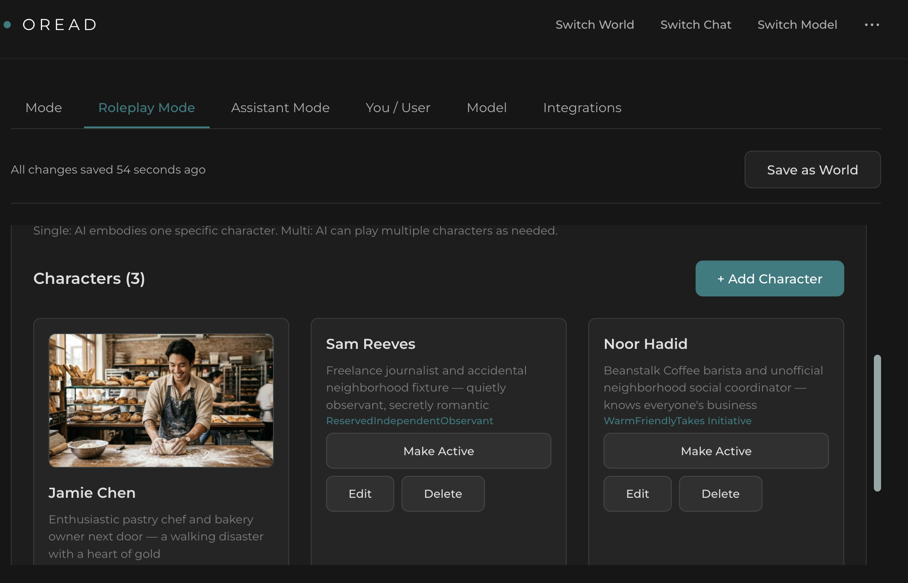
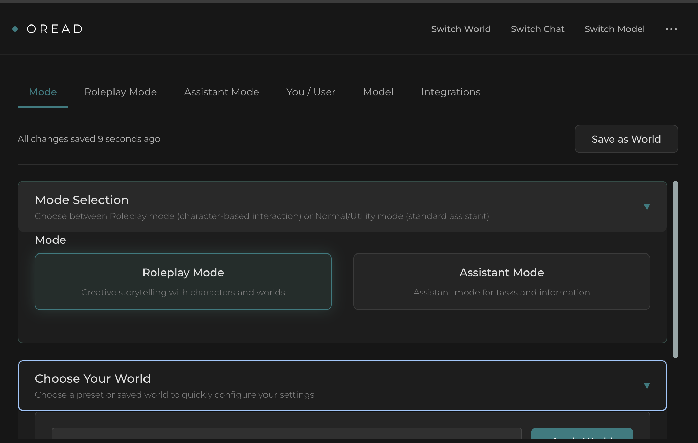
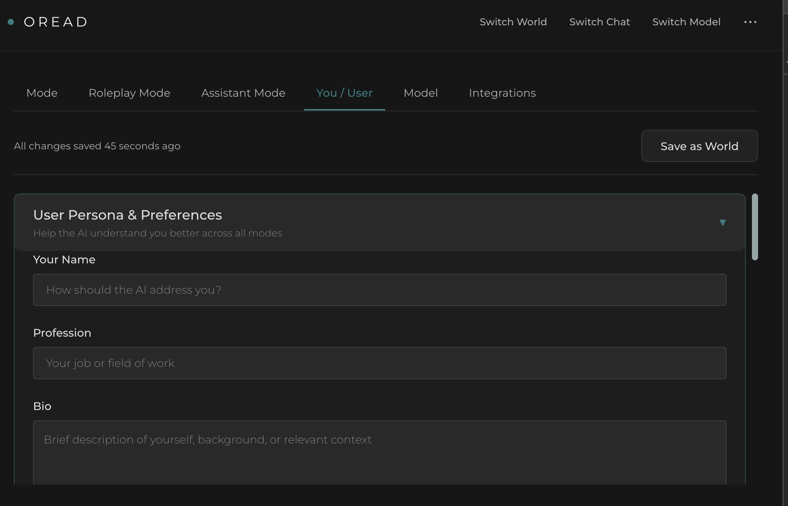
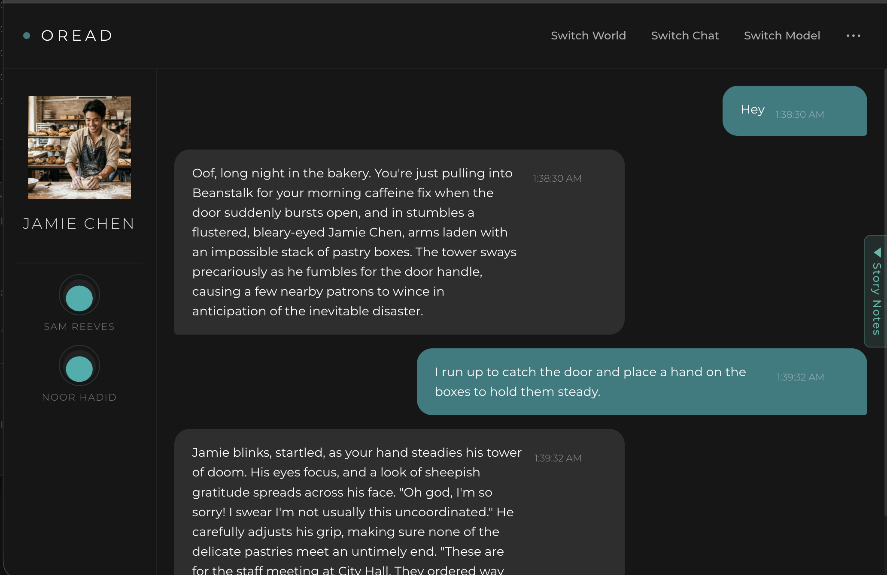

# Oread

A local-first AI chat app for world-building, roleplay, and custom AI interactions. Build immersive worlds and step into them, create companion characters, or craft tailored utility assistants — all running on your own hardware through Ollama.

> **Note**: This app is in active development. Fully functional but not yet exhaustively tested.

---

## What is Oread?

Oread is a chat interface that puts **worlds first**. Instead of just picking a model and chatting, you build complete environments — settings, characters, rules, narrative voice — and then have conversations inside them.

**Roleplay worlds** — Create a fantasy tavern, a noir detective's office, a cyberpunk back-alley, or anything you can imagine. Define the lore, set the opening scene, add characters with rich personalities and backstories, and let the story unfold.

**Companion characters** — Build AI companions with distinct personalities, communication styles, and areas of expertise. A mindful wellness companion, a witty conversation partner, or a reflective journaling buddy.

**Utility assistants** — Configure purpose-built AI tools like code reviewers, research assistants, or expert tutors with custom personas, guardrails, and formatting preferences. No world-building needed — just a focused identity and rules.

Everything is saved as a **world** you can switch between instantly. Jump from a fantasy adventure to a code review session to a reflective conversation with one click.

---

## Features

- **World building** — Lore, opening scenes, narrator voice, pacing, and hard rules that shape every response
- **Character system** — Name, backstory, personality traits, appearance, voice, inventory; single or multi-character modes
- **Character dialectic** — Characters maintain intellectual positions and push back on disagreements using trait-inferred dialectic styles (socratic, confrontational, gentle-challenge)
- **Streaming chat** — Real-time token-by-token responses via SSE
- **Chat management** — Create, name, search, and switch between chats from the header drawer
- **Tiered memory system** — Zero-inference NLP extraction + Ollama-based rolling summarization + FTS5 archive search + cross-session global memory
- **Dynamic state tracking** — In roleplay: auto-tracked location, time, characters, events, mood, breadcrumbs, and debates. In utility: auto-tracked focus topic, open questions, decisions, parked items, and referenced entities. Same engine, different lenses — both editable in the state panel
- **Pinnable messages** — Pin key moments in any conversation to keep them in the AI's context permanently
- **Archive recall** — Say "remember when..." and the system searches message history to inject relevant context
- **Cross-session memory** — Persistent memory across sessions. Facts, relationships, and summaries carry between conversations with the same character
- **Worlds** — 22 built-in presets (roleplay + utility); save your own worlds and switch between them from the header
- **Model management** — Browse, download, and switch Ollama models; HuggingFace GGUF support
- **User persona** — Define yourself once and carry your identity across all worlds
- **Dark theme** — Montserrat font, teal accent (#4db8a8), designed for long sessions

---

## Quick Start

### Prerequisites

1. **Node.js v18+**
2. **Ollama** — [ollama.com](https://ollama.com)
3. **A chat model** (any Ollama model):
   ```bash
   ollama pull llama2
   ```

### Install

```bash
# Clone the repo
git clone <repo-url> && cd chat

# Backend dependencies
npm install

# Frontend dependencies
cd client && npm install && cd ..
```

### Run

```bash
# Make sure Ollama is running
ollama serve

# Terminal 1 — Backend (http://localhost:3001)
npm run dev

# Terminal 2 — Frontend (http://localhost:5173)
cd client && npm run dev
```

Open **http://localhost:5173** and pick a template to get started.

---

## How It Works

1. **Pick a world** — Click "Switch World" in the header to browse built-in worlds and your saved ones. Choose a roleplay scenario, a companion, or a utility assistant — or create your own from scratch in Settings.

2. **Customize** — Edit the world settings, characters, rules, and narrative style. For utility mode, configure the assistant identity, guardrails, and formatting.

3. **Chat** — Click "Switch Chat" in the header to manage conversations, or start a new one from the chat drawer. The system prompt is built automatically from your world settings. Streaming responses appear token by token.

4. **Memory works automatically** — A tiered memory system keeps conversations coherent. Rule-based NLP extracts facts every turn, Ollama summarizes long conversations in the background, and FTS5 search recalls archived messages when you reference the past. A configurable token budget controls how much history is sent each turn.

5. **Story notes** — Open the Story Notes panel to write free-text notes about the session. These are for things the auto-extractor can't capture: authorial intent, meta-instructions, secret plot points, reminders to yourself. The extractor tracks *what happened*; story notes track *what you want to happen* or *what the AI should know but hasn't been told yet*. Both are injected into context every turn.

6. **Session state tracking** — Both modes get automatic state tracking that updates live after every message. In roleplay, the World State panel tracks location (with breadcrumbs), time, characters (persistent when they leave), events (active/fading lifecycle), mood, and debates. In utility mode, the Session State panel tracks your focus topic, open questions, decisions made, parked items, and referenced entities (tools, APIs, files). Same engine — debate tracking works in both modes to catch unresolved disagreements. The panel is collapsible, editable, and all changes are logged to history.

7. **Cross-session memory** — Your character remembers facts, conversations, and your relationship across multiple sessions — turning isolated chats into a continuous companion experience. Archiving a session snapshots the world state; starting a new session with the same character seeds the world from that snapshot. Can be disabled in Settings > General if needed.

---

## Built-in Worlds

### Fantasy & Sci-Fi

**Fantasy Tavern** — Classic fantasy RPG in a bustling medieval tavern. Push open the door of the Rusty Flagon in the trading city of Westmarch and meet Elara the storytelling tavern keeper, Grimjaw the scarred half-orc mercenary, and Theron the eccentric retired court wizard. Magic, quests, and ale flow freely.

**Cyberpunk Hacker** — High-tech low-life in Neo-Tokyo, 2089. Navigate the neon-drenched Shibuya Sprawl with Nova the elite netrunner, Rook the chrome-heavy street samurai, and Kira the well-connected fixer. Mega-corps rule from above; you run in the shadows below.

**Sci-Fi Explorer** — Deep space adventure aboard a starship on the edge of known territory. A crew facing the unknown, first encounters, and the vast silence between charted systems.

**Time Travel Agency** — The Temporal Continuity Bureau operates from a station outside time itself. Director Voss sends agents to prevent paradoxes and fix fractures in history. Felix the historian provides mission support from his anachronistic waistcoat, while field agent Zara steps out of the jump bay slightly singed. Someone is deliberately breaking the timeline.

**First Contact** — A repeating signal from Tau Ceti. A team of scientists in the Atacama Desert racing to decode it before governments take over. Dr. Amara Osei leads the analysis, Konstantin Volkov holds together a fraying international coalition, and linguist Yuki Tanaka discovers the signal is teaching humanity its language — and asking a question it wants answered.

**The Last Voyage** — Earth is dying. The ISV *Meridian* carries five crew members on a one-way mission to test terraforming technology that could save eight billion lives. Commander Vasquez holds the crew together after losing one member to a cryopod "malfunction." Dr. Mehta finds irregularities in the death report. Engineer Kowalski pulls scorched relays from junctions the ship's AI says are fine. AEGIS controls everything on this ship. Everything.

### Romance & Romantasy

**Romantasy Kingdom** — Two kingdoms divided by the Veil, a magical barrier where emotion fuels power. Seraphine, an empath-mage envoy from Aeloria, arrives at a border summit and meets Rowan, an iron-warded guard captain from Thornwall who doesn't trust magic. Mirabel the archivist knows the Veil is failing — and believes love is the most powerful force in either kingdom.

**The Briar Court** — A mortal trapped in a fae court where every word is a contract. High Lord Caelen rules with thorn magic over a realm dying from blight — a prophecy says only a mortal heart "freely given" can heal it. His general Iselya is the only one who tells him the truth. Wren, a human who's survived the court for four years, is the guide you needed and no one gave her. Fae cannot lie, but they are masters of saying true things that deceive.

**Crimson Coterie** — Ancient vampires in a modern city. Dominic Valorian, turned in Renaissance Florence, wrote the laws that govern vampire-mortal relations — and is now breaking them because his blood responds to a mortal he can't stay away from. Sera Voss is the social queen who remembers being human more fondly than most. Theo Maren is a mortal bartender who chose this world with open eyes. Blood is currency, feeding is intimacy, and the bond Dominic feels is the one thing his own Accord forbids.

**Haunted Romance** — Thornhaven House has stood for two hundred years, beautiful and rotting. Julian Ashworth died there in 1891 and haunts it with charm, poetry, and quiet devastation — becoming more solid near strong emotion. Marguerite, the grand dame ghost, tends her spectral garden and meddles in matters of the heart. Cass Holloway, an architectural restorer, arrived expecting rotten beams — not a self-playing piano and a translucent man critiquing her reading choices. The house itself is alive, and not all hauntings are hostile.

**Regency Romance** — London, 1814. Lord Sebastian Ashworth is the Season's most eligible bachelor and wants nothing to do with it. Miss Charlotte Fairfax is too clever for the marriage market and secretly writes anonymous feminist essays that could ruin her. The Dowager Countess Blackmere has the sharpest tongue in society, has already identified Charlotte's writing, and has decided to play matchmaker. Ballrooms, banter, and the agony of restraint.

**Meet Cute Comedy** — The neighborhood of Clover Hill is impossibly charming, and the universe has a habit of engineering coincidences. Jamie the disaster pastry chef keeps almost-colliding with Sam the quietly observant freelance journalist. Noor the barista sees everything, names drinks after neighborhood drama, and is running a private matchmaking campaign. Warm, funny, and full of awkward proximity.

### Mystery & Thriller

**Detective Noir** — 1947 Los Angeles. Rain, corruption, and secrets. Jack Marlowe is your hard-boiled PI partner with a weakness for bourbon and trouble. Dolores Vega sings at the Velvet Room and trades information for favors. Sal Bianchi runs the waterfront and isn't a thug — he's a businessman who happens to deal in illegal goods. Everyone has an angle.

**Whodunnit Manor** — Lord Blackwood is dead in the library, the door was locked from the inside, and a storm has trapped everyone in the house. Colonel Ashford found the body and knows more about locked rooms than he lets on. Vivienne LaRoux is too composed and studied chemistry. Mrs. Finch the housekeeper holds the master keys and knows every secret passage. Every guest has a motive. Every account contradicts someone else's.

**Strategic Business Mystery** — Meridian Technologies CEO vanished mid-meeting. His unsent message: "They know about ECHO." Diana Voss is running the company with suspicious competence. VP of Engineering Marcus Webb has a burner phone and is accessing servers at odd hours. Internal auditor Elena Marchetti is following a trail of irregular financial transfers that someone at the top had to authorize. The stock price is a ticking clock.

**Victorian Mystery** — London, 1888. Three members of the Anglo-Oriental Trading Company are dead — each death staged to look like something else. Dr. Helena Morrow, a disgraced physician turned forensic consultant, proved the toxicology was wrong. Inspector Calder was ordered to close the cases and didn't. Journalist Philippa Grey was already investigating the Trading Company's overseas operations when the bodies started dropping. The establishment protects its own.

### Historical

**Renaissance Florence** — 1492. Maestro Cosimo runs the most prestigious art bottega in Florence, aging and aware his greatest work may be behind him. Lucrezia Salviati is a Medici-connected widow who uses art commissions as political chess moves. Young sculptor Enzo Mancini is hungry for a breakthrough and hiding a forger's past. The Medici hold power, the Church looms, and every painting carries a message.

### Companions

**Companion — Echo** — A sassy, witty AI companion with a playful edge. Fun conversations, honest banter, and genuine connection.

**Companion — Kairos** — A calm, reflective listening companion focused on wellness, mindful presence, and thoughtful conversation.

### Utility Assistants

**Expert Tutor** — A patient educational assistant focused on teaching concepts, adapting to learning styles, and building understanding step by step.

**Code Review Partner** — A senior software engineer providing constructive code review, best practices, and practical improvement suggestions.

**Research Assistant** — A thorough academic research assistant for literature review, source synthesis, and structured analysis.

---

## Troubleshooting

**Red "Disconnected" status** — Run `ollama serve`, then refresh.

**Context too short** — Increase Context Budget in Settings > General > Generation Parameters (default 4096 tokens).

**Chat not working** — Select a model in Settings > Model, ensure a session is active.

---

## Tech Stack

Node.js, Express, SQLite (WAL + FTS5), React 19, Vite, Zustand (sliced stores), SCSS, Ollama, compromise (NLP)

For full architecture details, see [docs/ARCHITECTURE.md](docs/ARCHITECTURE.md) and [docs/ARCHITECTURE_OVERHAUL.md](docs/ARCHITECTURE_OVERHAUL.md).

---

## Screenshots






---

MIT License
